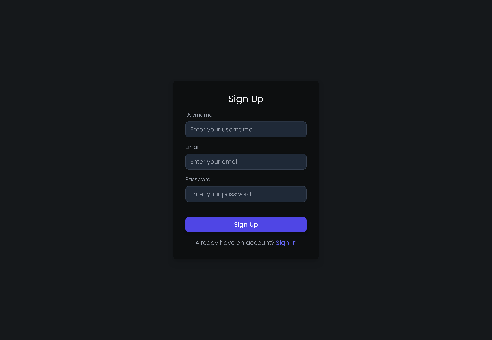
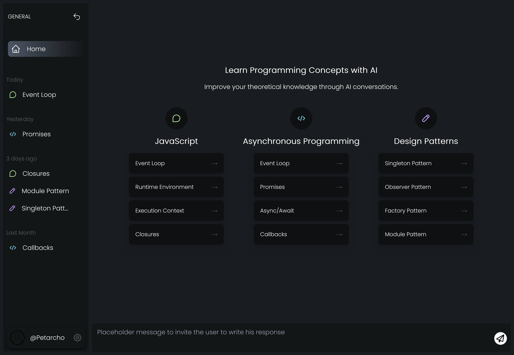

# Ask-AI

Ask-AI is a Next.js web application designed to help programmers and developers improve their theoretical knowledge through AI-driven conversational learning. Users can engage in interactive conversations with an AI, receive feedback on their answers, and gain suggestions for improvement, making it an ideal tool for enhancing theoretical understanding in various programming domains.

## Purpose

The application aims to assist developers in refining their knowledge by providing feedback on explanations, highlighting areas for improvement, and offering guidance on how to expand their understanding. By focusing on specific topics or subtopics, users can deepen their theoretical knowledge through conversational learning.

## About the Project

Ask-AI provides an interactive platform where developers can engage in conversations with an AI to improve their theoretical knowledge. By selecting a category and subcategory, users can tailor their learning experience to specific programming topics and receive real-time feedback from the AI, which helps identify strengths and areas for improvement.

## Features

- **Category and Subcategory Selection**: Users can focus on specific programming topics like JavaScript, Python, or Go, as well as areas like design patterns and system design.
- **AI-Driven Conversations**: The AI engages users in a dialogue, asking questions and providing explanations.
- **Feedback System**: Real-time feedback is provided to help users identify areas where their understanding is lacking.
- **Contextual Prompts**: The AI prompts users with questions based on their selected category and subcategory.
- **Conversation Constraints**: Structured conversation rules help maintain focused and productive discussions.

## Future Features

- **Internationalization**: Multilingual support to reach a global audience.
- **Progress Tracking**: Track user performance over time and provide analytics.

## Design and Layout

The design of the Ask-AI application focuses on user-friendly navigation and intuitive interfaces for an optimal learning experience. Below are screenshots and a short video demonstrating the core features.

### Visuals

<details>
  <summary>Login/Register Page</summary>
  
</details>

<details>
  <summary>Category Selection Page</summary>
  
</details>

### Demo Video

This video demonstrates how users can ask programming-related questions, and the AI will provide detailed feedback and suggestions for improvement.

[](https://youtu.be/nruIQ_akWag)

## Getting Started

To get a local copy up and running, follow these steps:

### Prerequisites

Ensure you have **Node.js** installed. You can download it from [Node.js](https://nodejs.org/).

### Installation

1. Clone the repository:
   ```bash
   git clone https://github.com/PetarIvanov01/ask-ai.git
   ```
